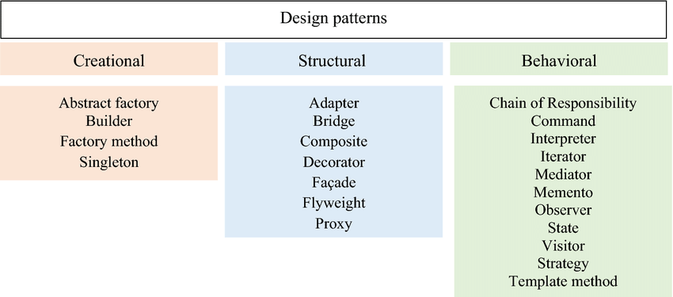
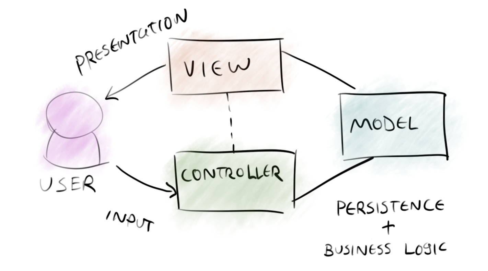
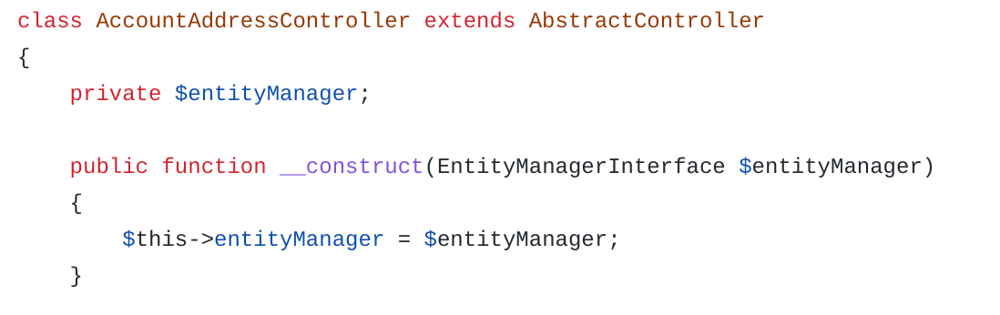
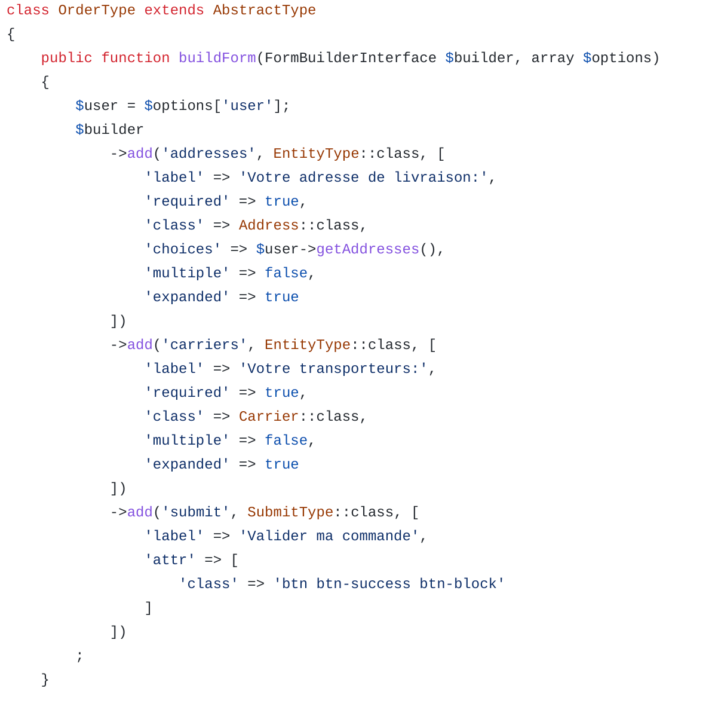
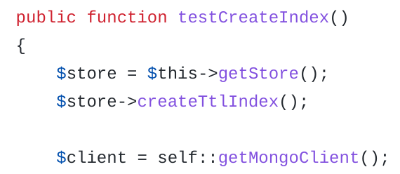
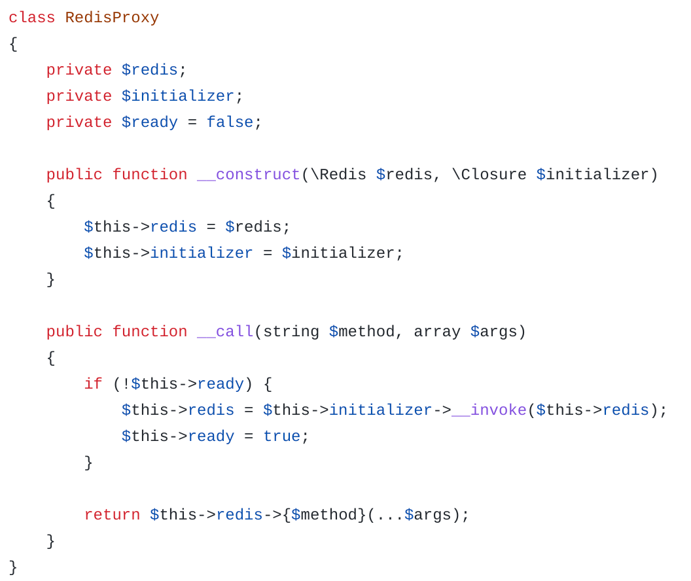
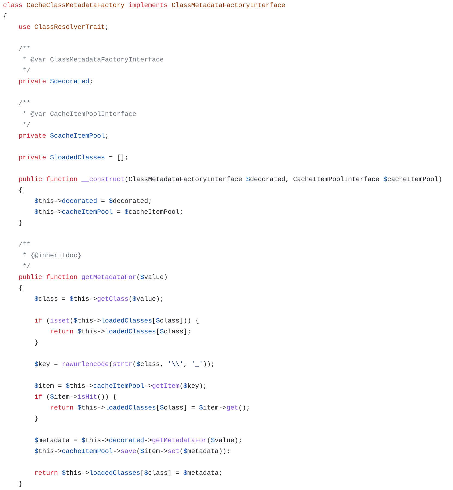

# Définition des Design Pattern

Les Design Pattern (patron de conception) sont des architectures logicielles permettant de répondre à des problématiques.
Il existe 3 types de Design Pattern
- création
- structuration
- comportement



C'est une bonne pratique de se reposer sur ces modèles, cela apportera également
- Un découpage plus fonctionnel de votre application
- Un code plus clair (mais éclaté dans plusieurs modèles) 
- Un programme plus générique qui gèrera mieux les différents cas d'usage (couche d'abstraction)

# MVC

C'est également une architecture logicielle qui permet de découper le code en plusieurs parties.
Il en existe plusieurs type :
- MVC
- MVT (dérivé de MVC)
- MVVM (.Net)

Le modèle est une représentation de la structure de votre base de données. On peut l'utiliser avec un ORM (par exemple Doctrine) : une classe est une table et une propriété est une colonne

La vue est un template HTML qui permet d'injecter des variables depuis le controlleur pour rendre un peu de dynamique dans l'HTML. On se repose sur un moteur de template pour faire cela (ex: Twig)

Le controlleur comporte la logique métier, c'est lui qui traite les données et gère le routage des requêtes HTTP.
C'est le point central de votre application



# Pré-requis

Installation de l'environnement de dev
```
docker build -t php7 .
```

Exécuter son code
`docker run -it --rm --name dp-php --network host --env-file=.env -v $(pwd):/usr/src/app php7 php index.php`

# Exo 1 : singleton

## Explication

Permet d'utiliser une seule instance de classe pour la réutiliser ultérieurement.

## Sujet

Veuillez mettre en place un singleton pour vous connecter en BDD

## Points clés 

- Constructeur en privé
- Mettre l'attribut en privée pour forcer le passage par la méthode `getInstance()`
- On vérifié l'id de l'objet avec `spl_object_id()` ou `uniquid()` dans le constructeur
- Il faut utiliser `::` pour appeler une propriété statique

# Exo 2 : Factory

## Explication

On délègue la création d'une instance de classe à une autre classe que l'on appelle `factory`
Cela permet de cacher la complexité et le mécanisme qui s'y trouve derrière

## Sujet

Créer un connecteur MYSQL et Postgres

## Points clés 

- Créer une interface commune
- Instancer la classe voulu dans la factory
- Appel de la factory en static

# Exo 3 : Injection des dépendances

## Explication

Lie 2 objets de manière dynamique afin de s'adapter au besoin
On donne une instance à une autre classe pour manipuler les données 

## Sujet

Effectuer une liste de tâche

## Points clés 

- Passer une instance en paramètre

# Exo 4 : DAO

## Explication

Est une abstraction de la persistence des données, proche de la BDD. Il est souvent couplé avec PDO
On va retrouver dans cette classe la manière de manipuler nos données (CRUD).
VS Repository : lui est plus proche de la logique métier, il manipule les DAO

## Sujet

Créer un DAO User pour obtenir l'existence d'un pseudo  

# Exo 5 : Observeur

## Explication

Basé sur SplSubject et SplObserver de PHP (mais pas obligatoire)
Permet de faire transiter une information lorsqu'un état change

## Sujet

Faire un mécanisme de notification de message

## Points clés

- Les interfaces SplSubject et SplObserver peuvent vous aider en PHP
- SplObjectStorage permet de stoquer les observers
- Un "client" doit avoir les méthodes `attach`, `detach` et `notify` pour gérer ses observers
- Les objects à observer sont des classes

# Exo 6 : Command

## Explication

Permet de séparer le code à l'origine de l'action et l'action elle même 

## Sujet

Créer un gestionnaire d'information en utilisant une commande à minima Echo et File
Ce Design Pattern est très proche du Strategy : le strategy se centre sur l'action alors que le Command sur l'algo

## Points clés

- On met en place une injection de dépendance
- L'invoker est la classe qui manipulera toujours la même méthode
- L'invoker reçoit une instance de classe (la commande) pour utiliser ses méthodes
- Les commandes sont executées par l'invoker
- Les commandes ont une interface

# Exo 7 : Strategy

## Explication

On manipule un seul composant pour des comportements (stratégies) différents. C'est à dire que l'algo change.
C'est le contexte qui s'occupe de faire le lien entre la classe créée et le fonctionnement demandé
Ce Design Pattern est très proche du Command : le strategy se centre sur l'action alors que le Command sur l'algo

## Sujet

Créer un gestionnaire d'information en utilisant une stratégie à minima Echo et File

## Points clés

- Implémenter une interface commune 
- Le contexte doit utiliser cette méthode commune sans (forcément) savoir quel objet il manipule

# Exo 8 : Decorateur

## Explication

Permet d'ajouter des comportement sur des objets

## Sujet

Réaliser un décorateur qui modifie l'affichage des logs en fonction de la verbosité souhaité

# Exo 9 : Builder

## Explication

Permet de découper la construction d'un objet en partie moins complexe

## Sujet

Construire une maison (toit, porte, fenetre ...) selon ce principe

## Points clés

- On utilise une injection de dépendance dans le builder
- Le builder se repose sur une interface qui cadre sont utilisation
- On créé une classe qui hérite de builder en surchargeant les méthodes utiles

# Exo 10 : Adapter

## Explication

Fait office d'interface entre 2 objets ne pouvant pas communiquer entre eux

## Sujet 

Constuire un adapter pour afficher la liste des jeux disponibles dans une plateforme de vente en ligne

# Exo 11 : State

## Explication 

Modifit le comportement d'un objet en fonction d'une situation 

## Sujet

Gérer un stock entrant et sortant d'un magasin

# Symfony

Regardez dans ce framework, et donc dans un de vos projets, les Design Pattern les plus utilisés :

- Injection de dépendance



- Builder



- Singleton



- Strategy



- Factory


